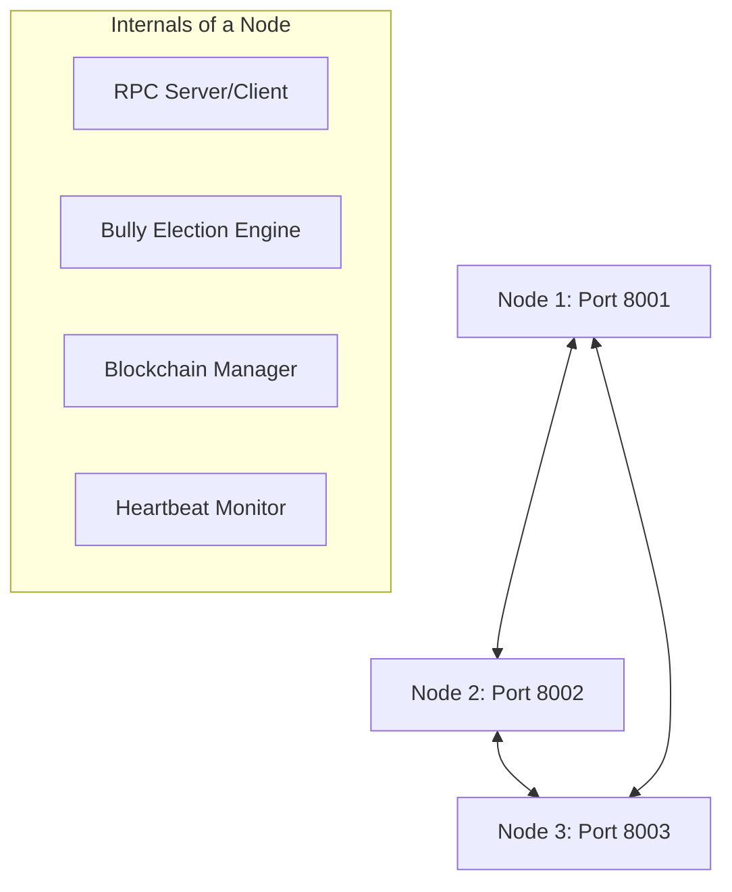

# Blockchain Distribuída com Algoritmo de Eleição Bully

Este projeto implementa um sistema distribuído de **Blockchain** em **Go**, projetado para a cadeira de Sistemas Distribuídos. O sistema utiliza o **Algoritmo Bully** para gerenciar a eleição de um nó coordenador (líder), garantindo alta disponibilidade e consenso na rede.

## 🚀 Regra de Negócio: Ledger de Transações

O sistema opera sob a regra de um **Livro Razão (Ledger) Financeiro**.
- **Transação**: Cada transação possui um emissor (`sender`), um receptor (`receiver`) e um valor (`amount`).
- **Validação**: Apenas blocos com hashes válidos (baseados no conteúdo do bloco e no hash do bloco anterior) são aceitos pela rede.
- **Consenso**: O líder atual é o único responsável por agregar transações em blocos e propagá-los para os outros nós.

## 🏗️ Arquitetura do Sistema

A solução é composta por nós independentes que se comunicam via **RPC (Remote Procedure Call)**.



### Componentes Principais:
- **`pkg/blockchain`**: Estruturas de dados de Blocos e Cadeia, incluindo lógica de hashing SHA-256 e prova de trabalho (PoW) simplificada.
- **`pkg/bully`**: Gerenciamento de estado do nó (ID único, líder atual e status de eleição).
- **`pkg/network`**: Handlers RPC para eleição (`Elect`, `Coordinator`), sincronização de blocos e batimento cardíaco (`Heartbeat`).

## 🗳️ Algoritmo de Eleição Bully

O algoritmo garante que o nó com o **maior ID numérico** disponível sempre será o líder:
1. Se um nó detecta que o líder caiu (falha no Heartbeat), ele inicia uma eleição enviando mensagens para todos os nós com ID superior.
2. Se nenhum nó superior responder, o nó emissor se torna o líder e avisa a rede.
3. Se um nó superior responder "OK", ele assume o processo de eleição.

## 🛠️ Como Executar

### Pré-requisitos
- [Go](https://golang.org/dl/) instalado (v1.16+ recomendado).

### Simulação Rápida (PowerShell)
Para Windows, você pode usar o script de simulação que abre 3 terminais automaticamente:
```powershell
./simulate.ps1
```

### Execução Manual
Para rodar nós individualmente, use os comandos abaixo em terminais diferentes:

**Nó 1 (ID 1, Porta 8001):**
```bash
go run cmd/node/main.go -id 1 -port 8001 -peers 2:8002,3:8003
```

**Nó 2 (ID 2, Porta 8002):**
```bash
go run cmd/node/main.go -id 2 -port 8002 -peers 1:8001,3:8003
```

**Nó 3 (ID 3, Porta 8003):**
```bash
go run cmd/node/main.go -id 3 -port 8003 -peers 1:8001,2:8002
```

## 📂 Estrutura de Diretórios

```text
.
├── cmd/
│   └── node/main.go       # Ponto de entrada da aplicação
├── pkg/
│   ├── blockchain/        # Estruturas e lógica da blockchain
│   ├── bully/             # Estado do nó e lógica bully
│   └── network/           # Comunicação RPC e handlers
├── simulate.ps1           # Script de simulação automática
└── go.mod                 # Definições do módulo Go
```