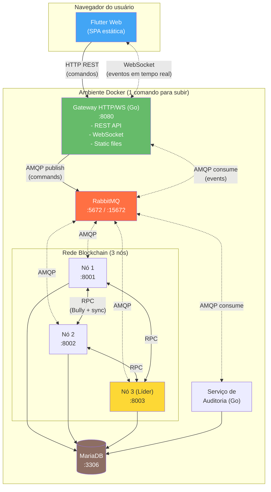
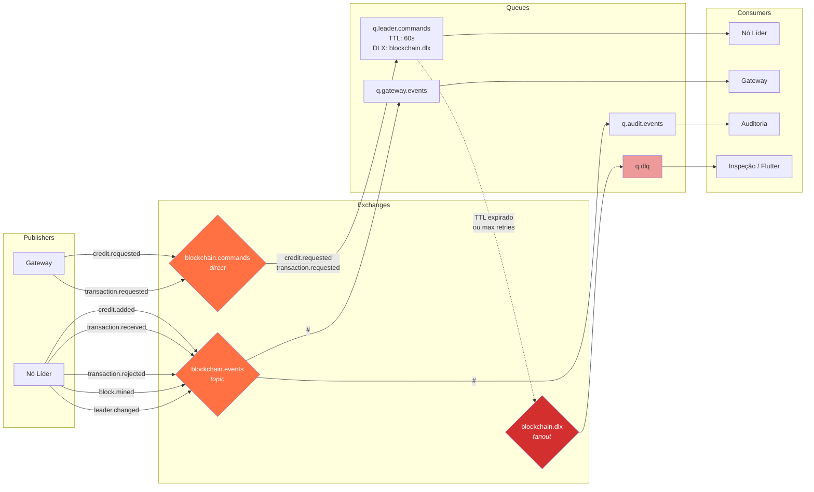
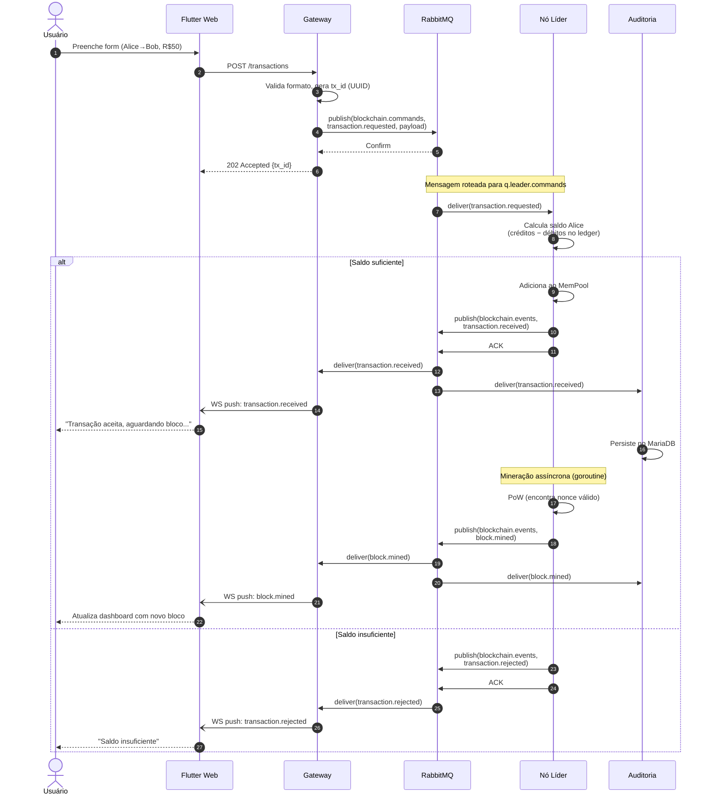
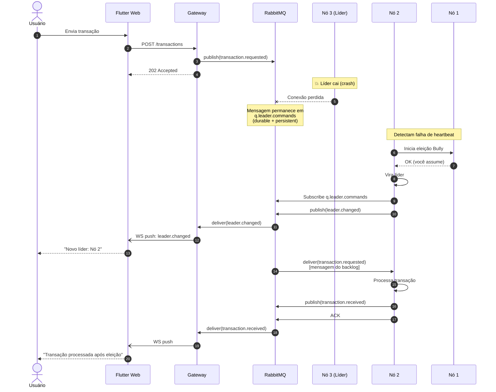
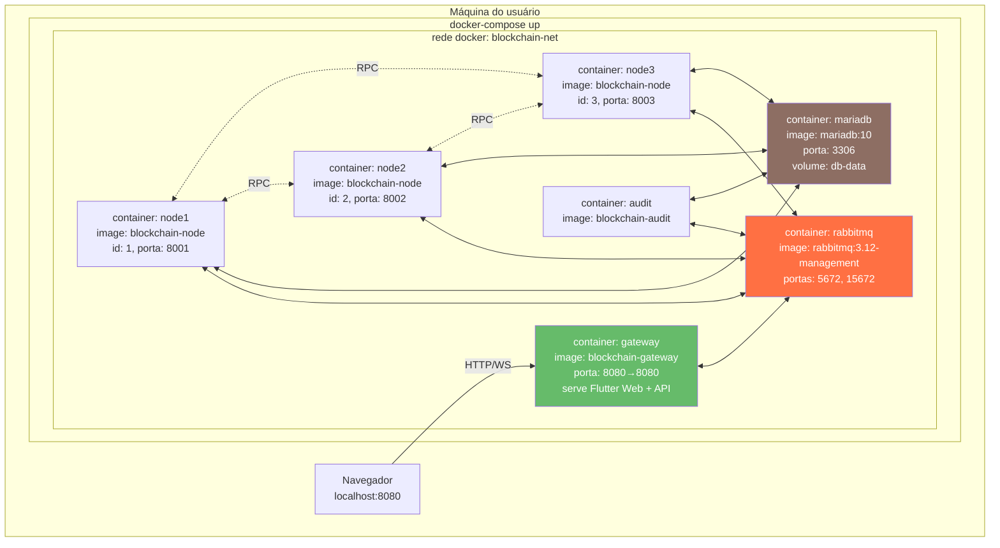
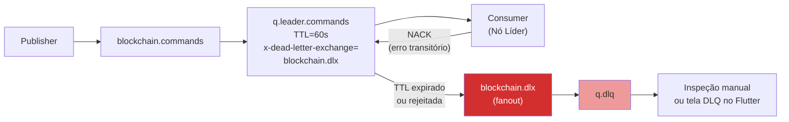

# Diagramas — Etapas 1 e 2

Diagramas em **Mermaid** (renderizam nativamente no GitHub e na maioria dos editores Markdown).

---

## 1. Diagrama de Componentes (visão alto nível)

Mostra os blocos arquiteturais da solução e como se relacionam.

**Legenda:**
- Linha cheia = comunicação síncrona (HTTP, RPC).
- Linha tracejada = comunicação assíncrona (AMQP, WebSocket).
- Nó destacado em amarelo = líder atual da blockchain.

---

## 2. Topologia RabbitMQ — Exchanges, Filas e Bindings

Mostra a estrutura interna do broker.

---

## 3. Fluxo de Mensagens — Transferência com Validação de Saldo

Sequência completa de uma transação bem-sucedida.

---

## 4. Tolerância a Falhas — Eleição Bully com Fila Persistente

Mostra como a fila preserva mensagens durante a troca de líder.

---

## 5. Deployment Docker (execução única)

Topologia física dos containers em uma única máquina.

**URLs expostas ao usuário:**

| URL | Conteúdo |
|---|---|
| `http://localhost:8080` | Flutter Web (interface principal) |
| `http://localhost:8080/api/*` | API REST do Gateway |
| `ws://localhost:8080/ws` | Stream de eventos em tempo real |
| `http://localhost:15672` | Painel de management do RabbitMQ (`guest/guest` em dev) |

---

## 6. Pipeline de Retry e DLQ

Como uma mensagem com falha transita até chegar na DLQ.

**Fluxo:**
1. Publisher envia mensagem para `blockchain.commands`.
2. Roteada para `q.leader.commands`.
3. Consumer processa; em caso de erro recuperável, faz NACK (mensagem volta).
4. Após N tentativas ou TTL de 60 s, RabbitMQ aplica DLX → roteia para `blockchain.dlx`.
5. Mensagem cai em `q.dlq` para inspeção.
6. Operador analisa via tela "DLQ" no Flutter ou painel RabbitMQ.

---

> Os diagramas acima cobrem os requisitos das Etapas 1 e 2. Diagramas mais específicos (configuração detalhada de bindings, payload examples) aparecem nas Etapas 3 e 4.
